- 👋 Hi, I'm Fernando a Junior Data Scientist with a genuine passion for learning. I thrive on the creative process and enjoy contributing my skills at every stage of a project.
  I just finished the Data Science Tripleten's Bootcamp and I'm excited to put into practice the knowledge I have gained on this learning journey!
  
- 📫 How to reach me: 
* :e-mail: gomezcastrohf@gmail.com
* :iphone: +593 993 871 686

### :hammer_and_wrench: Lenguajes y herramientas :

## 📊 My stats

<!---
Fgc94/Fgc94 is a ✨ special ✨ repository because its `README.md` (this file) appears on your GitHub profile.
You can click the Preview link to take a look at your changes.
--->
